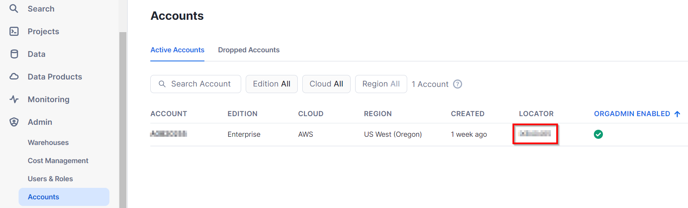
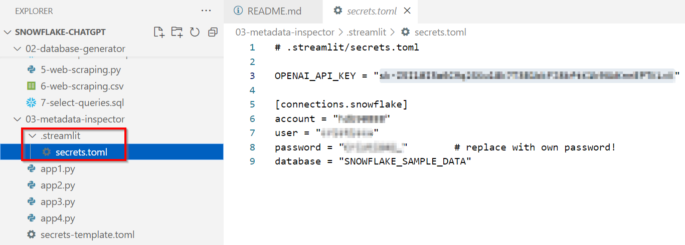

# Snowflake Account Configuration

[](https://www.youtube.com/watch?v=xcZhmJhuGow&list=PLWwulQvNh3MUNVsS3MoRcTecByVnX_fm5&index=3&pp=gAQBiAQB)

(1) Go to [**signup.snowflake.com**](https://signup.snowflake.com/) and create a free Snowflake trial account. There is no credit card required and no obligation whatsoever. You get US $400 credits to use on a free online Snowflake account for maximum 30 days.

Use an email address you did not use before. Select the Enterprise Edition, as it comes with more features we could try. To try most Public Preview features, select the AWS provider, in a US region close to you (the very new Snowflake features are usually available only on AWS).

(2) In your Snowflake web UI (also known as *'Snowsight'*), go to the *Admin > Warehouses* screen. Edit your default **COMPUTE_WH** warehouse and change the "Suspend After" parameter to only 1 minute (by default it could be 10 or 5 minutes!).

Locate and copy your account name from the **LOCATOR** field, in the *Admin > Accounts* screen:



(3) From VSCode's *Extensions* tab, install the [**Snowflake Extension**](https://docs.snowflake.com/en/user-guide/vscode-ext), which was created by Snowflake.  

Connect to Snowflake with your account name, plus the username and password you created for your ACCOUNTADMIN role.  

When configured correctly, you should be able to see and execute SQL statements directly from SQL files in VSCode, through *Execute* links.

(4) [Install and configure **SnowSQL**](https://docs.snowflake.com/en/user-guide/snowsql-install-config), which is the free command-line tool for Snowflake.  

Add in your *~\.snowsql\config* file a new *"connections.test_conn"* section with your own Snowflake connection parameters:  

```
[connections.test_conn]
accountname = ...
username = ...
password = ...
database = test
schema = public
warehouse = compute_wh
role = accountadmin
```

With this in place, you will be later able to run SQL scripts (like *my-script-file.sql* here below) from the command line with:  

**`snowsql -c test_conn -f my-script-file.sql`**

(5) If you use Streamlit to connect to Snowflake (with **st.connection** calls) through a TOML file, you may need to create a ".streamlit" subfolder with a **.streamlit/secrets.toml** text file with the following section:

```
[connections.snowflake]
account = "..."
user = "..."
password = "..."
database = "test"
schema = "public"
warehouse = "compute_wh"
role = "accountadmin"
```



Never publish your TOML files to a remote repository!

(6) From the root folder in a Terminal, test your Snowflake connection with:

**`python snowflake-test.py`**

This should show help on the *OneHotEncoder* class from Snowpark ML. Exit with CTRL_C.

To keep it simple, we'll try to use almost everywhere only the following simple Python code snippet, to connect to Snowflake through a Snowpark session:

```
from snowflake.snowpark import Session
from snowflake.ml.utils.connection_params import SnowflakeLoginOptions
session = Session.builder.configs(SnowflakeLoginOptions("test_conn")).create()
```

To replace some saved connection parameters, you may do something like:

```
from snowflake.snowpark import Session
from snowflake.ml.utils.connection_params import SnowflakeLoginOptions

pars = SnowflakeLoginOptions("test_conn")
pars["schema"] = "diamonds"
pars["warehouse"] = "large"
session = Session.builder.configs(pars).create()
```

Remark that the *SnowflakeLoginOptions* class is in preview at this moment and you may get a warning you can ignore each time you call it.
