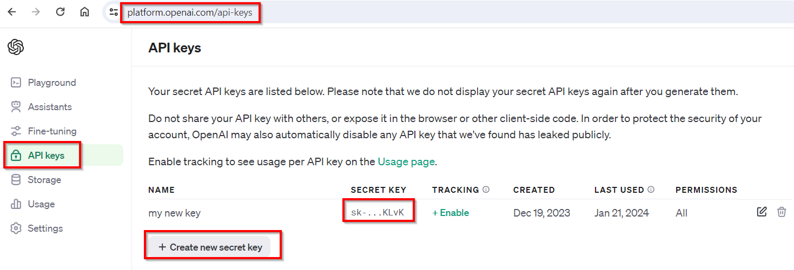

# ChatGPT Account Configuration

These steps are optional, if you need to experiment with the OpenAI API in your Python code.

(1) Login with your Microsoft or Google account at [**platform.openai.com**](https://platform.openai.com/). For new accounts, OpenAI may still offer US $5 credits for max 3 months. Otherwise provision your account with $5 from a credit card (it should be more than enough for all kind of experiments).

(2) Create a new secret key in the *API keys* screen. Remark that once you create a secret key online, you can no longer see it in clear, this is the only time!

Copy and save that key into a **OPENAI_API_KEY** environment variable only you may have access to:

You may later connect to OpenAI from Python with:

**``client = OpenAI(api_key=os.environ["OPENAI_API_KEY"])``**

(3) In VSCode, install the free [**ChatGPT Genie AI plugin**](https://github.com/ai-genie/chatgpt-vscode) and connect with your OpenAI API key.  

(4) If you use Streamlit with a TOML file, you may need to create a ".streamlit" subfolder with a **.streamlit/secrets.toml** text file and add the following setting:

**`OPENAI_API_KEY = "sk-Z5I..."`**

You may later connect to OpenAI from Python with:

**``client = OpenAI(api_key=st.secrets["OPENAI_API_KEY"])``**
